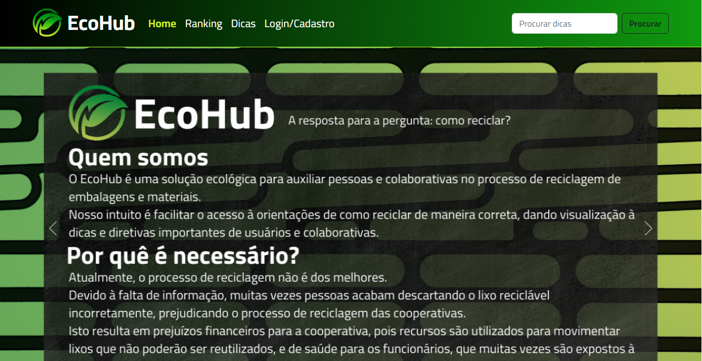
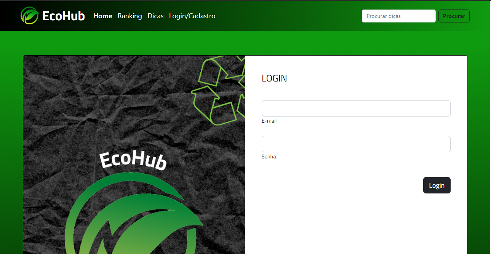
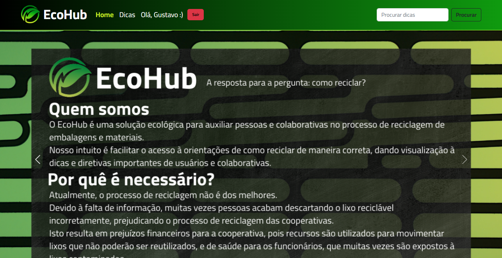
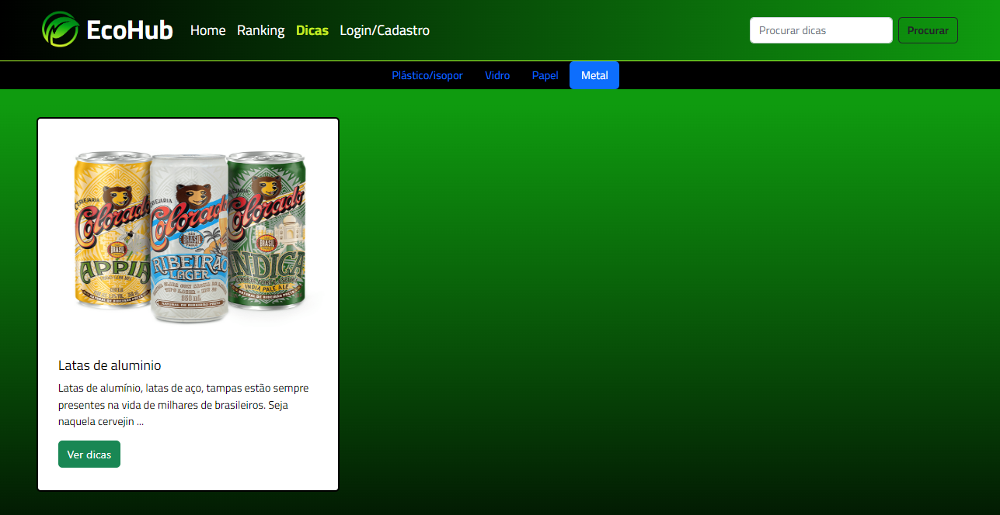
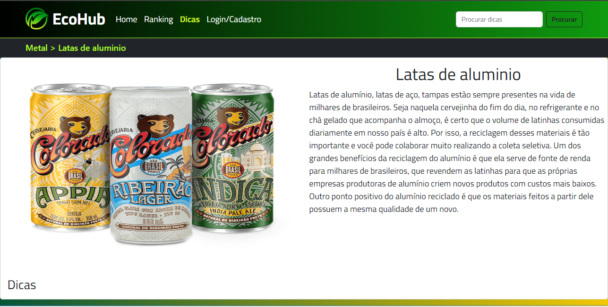
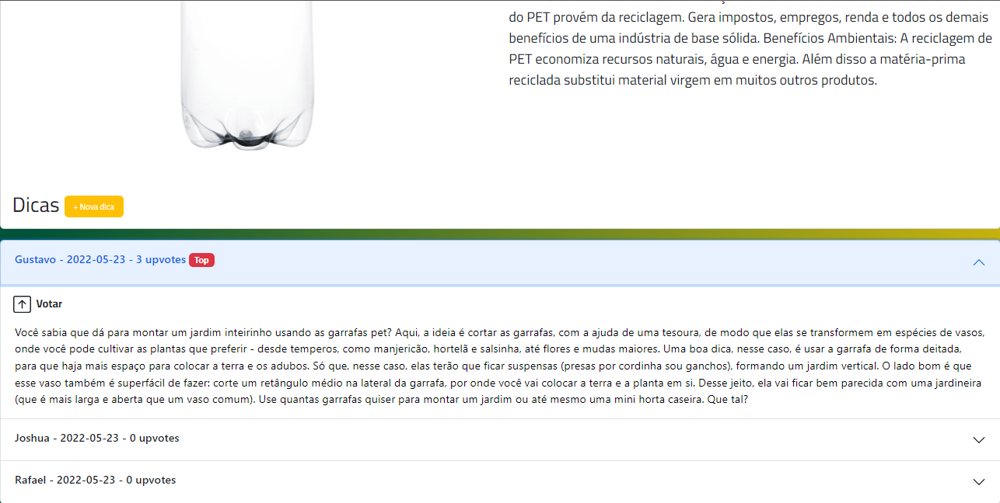
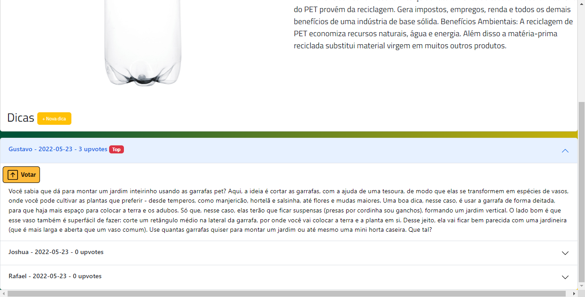
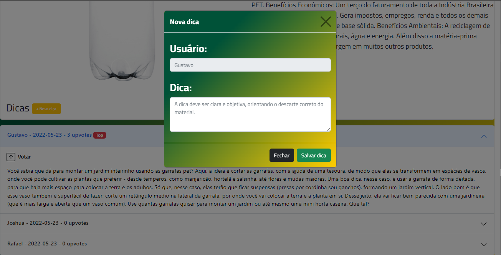
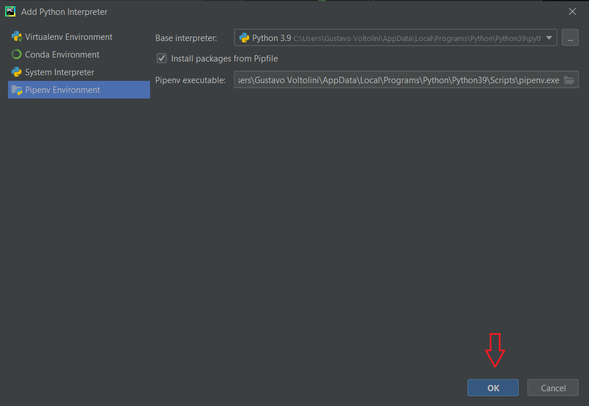

# EcoHub - ReciclaHack Project

EcoHub é o projeto oferecido como solução para o ReciclaHack Hackathon feito pela Hackathon Brasil.
É um polo de informação e comunicação para reciclagem, proporcionando informações de fácil acesso e comunicação entre 
usuários e centros de reciclagem. Link para a página de informações do Hackathon: https://www.abre.org.br/reciclahack/.

---
EcoHub is the project offered as solution to the ReciclaHack Hackathon by Hackathon Brasil, made with Python and Flask Framework. It is an information and communication hub for recycling, providing easily accessible information and communication between users and recycling centers.
Link to Hackathon info page: [Recicla Hack](https://www.abre.org.br/reciclahack/.)

### Como funciona?

Dentro da Home Page você tem acesso as Dicas, poderá se cadastrar ou efetuar o login:

#### Login:
Clique em "Login/Cadastro" crie sua conta ou clique em "Ja possuo uma conta" para logar.

Após criar sua conta e logar você sera redirecionado para a Home Page, agora autenticado com o seu usuário, você terá acesso a todas as funcionalidades do sistema.

#### Visualizar e criar dicas:

Em "Dicas" você tera acesso as categorias de lixo reciclavel, você pode escolher uma categoria e assim encontrar os materias cadastrados daquela respectiva categoria.

Ao clicar em "Ver dicas" de algum material, você verá a descrição do material...

Ao descer você verá as dicas inseridas por usuários do sistema, se logado você poderá votar nas melhores dicas e inserir suas próprias dicas.

Para votar em um comentário basta clicar em "Votar":

Para enviar uma dica, clique em "+ Nova dica" e preencha os campos:

### Instalar dependências:

Para instalar as dependencias crie uma Pipenv:

#### obs: E necessario ter "pipenv" instalado no seu python para seguir. 

---

Após a instalação execute o comando:

`pipenv install`

## Inicializar projeto:

Execute o arquivo app/main.py

### Banco de dados:

#### Para atualizar banco de dados depois de alterações nos modelos:
Rode os seguintes comandos:

1º `flask db migrate`

2º `flask db upgrade`
