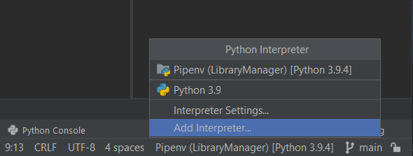

# EcoHub - ReciclaHack Project
EcoHub é o projeto oferecido como solução para o ReciclaHack Hackathon feito pela Hackathon Brasil.
É um polo de informação e comunicação para reciclagem, proporcionando informações de fácil acesso e comunicação entre 
usuários e centros de reciclagem. Link para a página de informações do Hackathon: https://www.abre.org.br/reciclahack/.

### Instalar dependências:

Para instalar as dependencias crie uma Pipenv:

#### obs: E necessario ter "pipenv" instalado no seu python para seguir. 

---

Após a instalação execute o comando:

`pipenv install`

## Inicializar projeto:

Execute o arquivo app/main.py

### Banco de dados:

#### Para atualizar banco de dados depois de alterações nos modelos:
Rode os seguintes comandos:

1º `flask db migrate`

2º `flask db upgrade`
